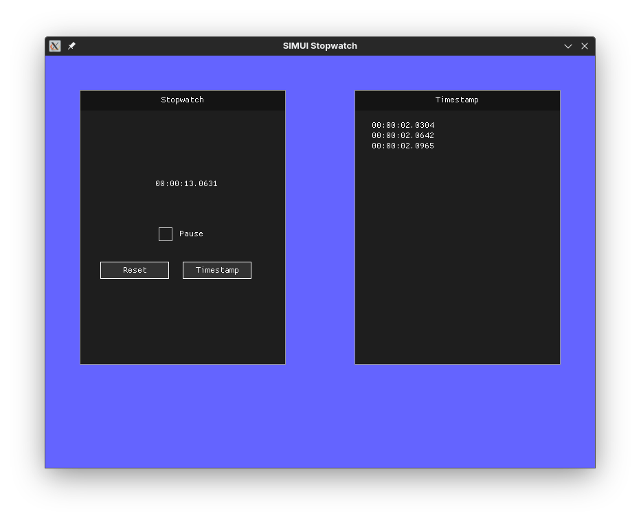

# SIMUI

**S**DL2 **I**mmediate **M**ode **UI**

`simui` is an immediate mode UI library for SDL2. It can be used within SDL2 applications or as a standalone UI library.
Creating and destroying the `SDL_Window` and `SDL_Renderer` and events specific to the user-created `SDL_Window`
must be handled by the user. The UI rendering and UI events are handled by `simui` itself.

# Example 
```c
#include "context.h"
#include "window.h"
#include <SDL2/SDL.h>

int main(void) {
  SDL_Init(SDL_INIT_VIDEO);

  // Creating the target window and its renderer.
  SDL_Window *target_window =
      SDL_CreateWindow("Test Window", SDL_WINDOWPOS_CENTERED,
                                     SDL_WINDOWPOS_CENTERED, 800, 600, SDL_WINDOW_SHOWN);
  SDL_Renderer *renderer = SDL_CreateRenderer(
                target_window, -1, SDL_RENDERER_ACCELERATED | SDL_RENDERER_PRESENTVSYNC);

  bool running = true;
  SDL_Event e;

  // Creating a simui context and specifying the window and renderer to use.
  simui_context_t context = simui_context_create(target_window, renderer);

  // Creating a simui window.
  simui_window_create(&context, (vec2f){90.0f, 90.0f}, (vec2f){300.0f, 300.0f});
  // Setting a new title for the simui window.
  simui_window_set_title(&context, "A new title.");
  // Adding text to the simui window.
  simui_window_text_create(&context, "Lorem ipsum dolor.", (vec2f){5.0f, 5.0f});

  // Creating a simui window.
  simui_window_create(&context, (vec2f){30.0f, 30.0f}, (vec2f){300.0f, 300.0f});
  // Adding text to the simui window.
  simui_window_text_create(&context, "The quick brown fox.",
                           (vec2f){5.0f, 5.0f}); 

  while (running) {
    while (SDL_PollEvent(&e)) {
      if (e.type == SDL_QUIT) {
        running = false;
      }

      // simui event handling.
      simui_context_handle_event(&context, &e);
    }

    SDL_SetRenderDrawColor(renderer, 100, 100, 255, 255);
    SDL_RenderClear(renderer);

    // simui rendering.
    simui_context_render(&context);

    SDL_RenderPresent(renderer);
  }

  // Destroying simui context.
  simui_context_destroy(&context);

  SDL_DestroyRenderer(renderer);
  SDL_DestroyWindow(window);

  return 0;
}
```



# Requirements
- C compiler
- SDL2

# Build and run
```
git clone https://github.com/wwsmiff/simui
cd simui
mkdir build
./build.sh
./build/main
```
